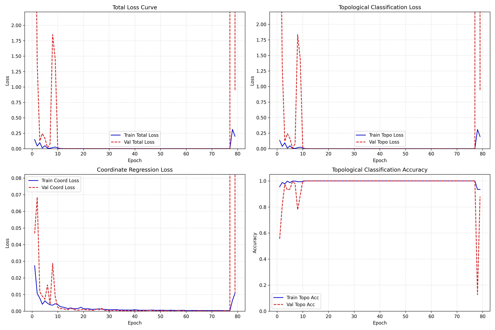
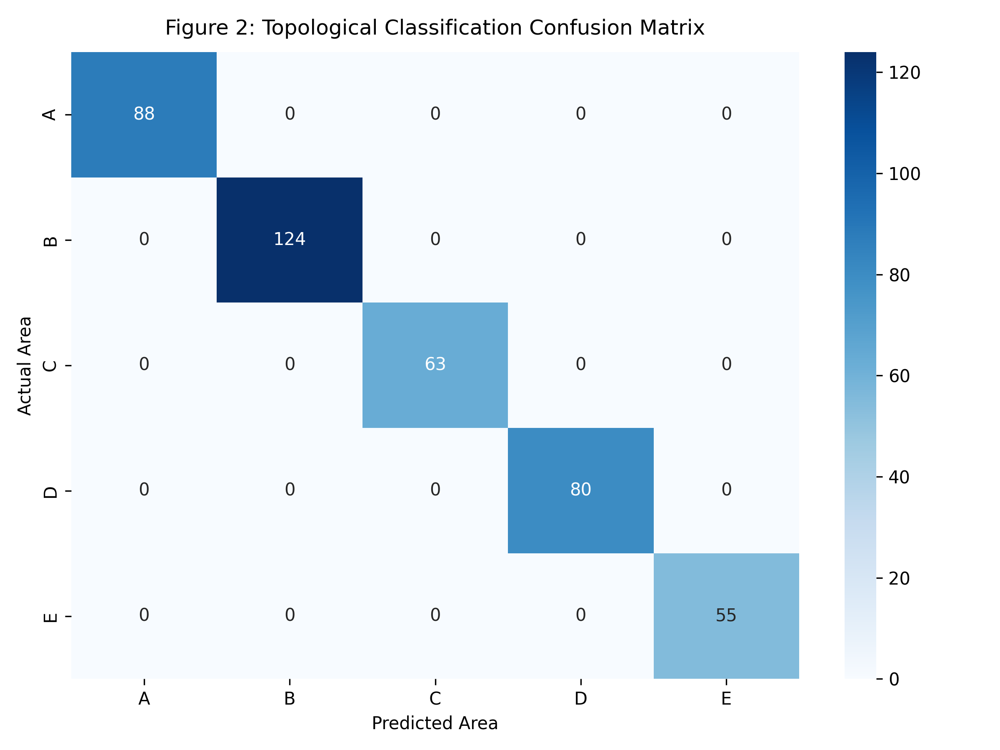
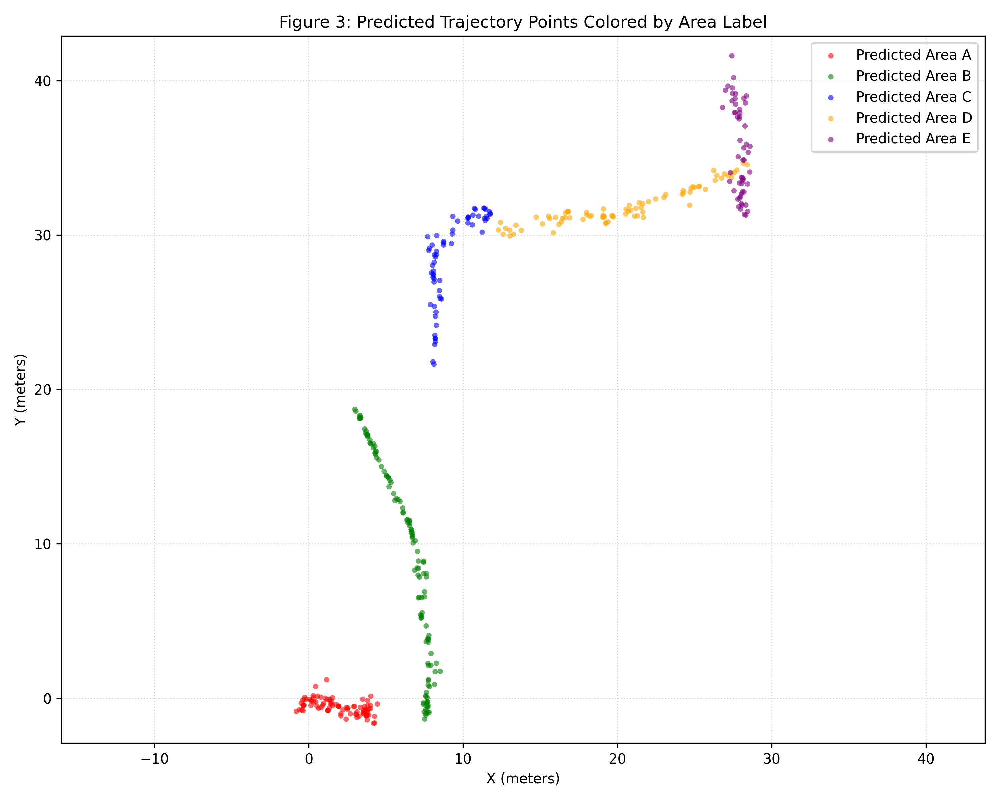
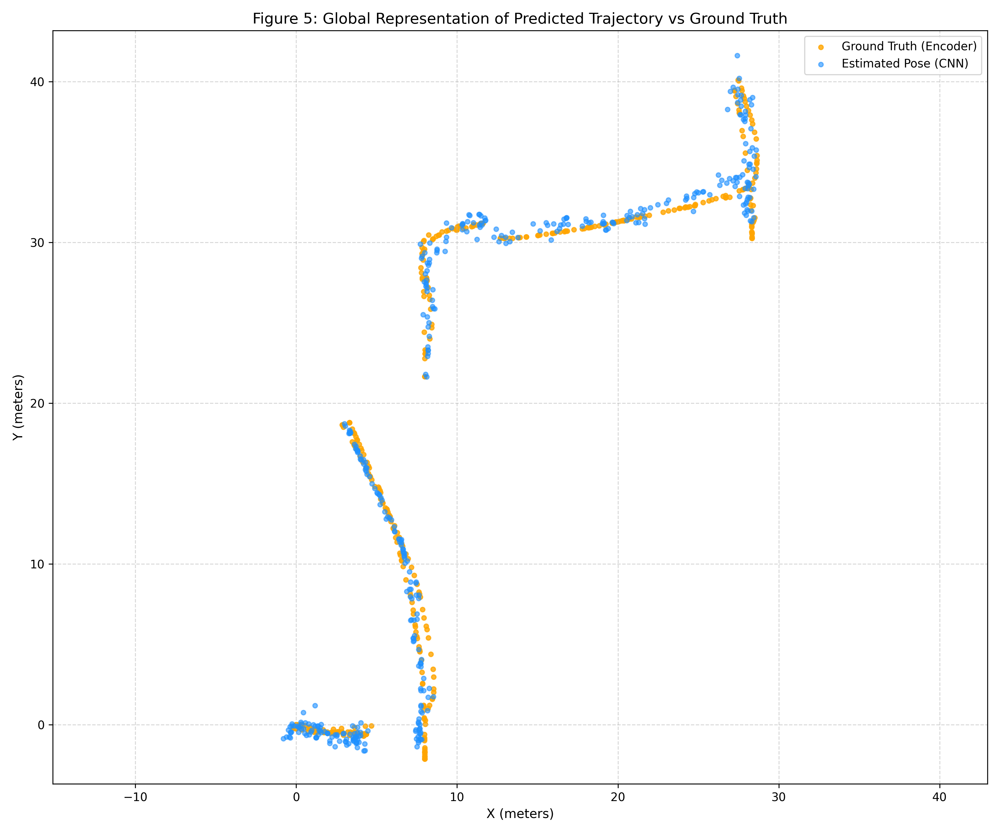
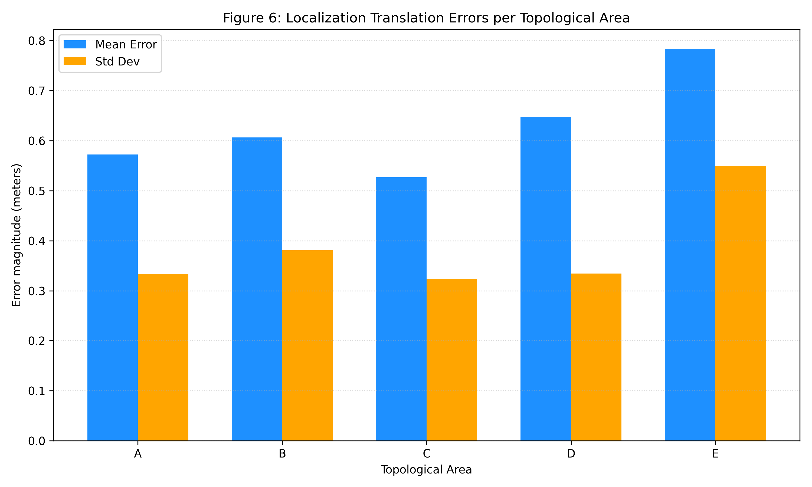

<div align="center">

# 🤖 RGB Dynamic Attention Localization

### Indoor Robot Localization via Feature-level Dynamic Attention from RGB Images

[](https://www.python.org/)
[](https://pytorch.org/)
[](LICENSE)
[](https://github.com)
[](https://developer.nvidia.com/cuda-toolkit)

[📖 Tiếng Việt](#) | [📖 English](#english-version)

</div>

---

## 📌 Tổng Quan Dự Án

Dự án triển khai hệ thống **định vị robot di động phân cấp trong nhà** từ ảnh RGB đơn kênh, kết hợp cơ chế **Feature-level Dynamic Attention** — tự động loại bỏ ảnh hưởng của vật thể động (người đi bộ) khỏi quá trình trích xuất đặc trưng.

Hệ thống giải quyết bài toán **đa nhiệm (Multi-task)**:
- **Nhánh 1 — Phân loại Topo** (`Classification`): Nhận diện khu vực địa lý (Area A–E).
- **Nhánh 2 — Hồi quy Vị trí** (`Regression`): Dự đoán tọa độ $(x, y)$ chính xác trong không gian thực (đơn vị mét).

> Inspired by: *"Indoor Robot Localization Based on Vision"* — Applied Sciences (2021).

---

## 🏆 Kết Quả Đánh Giá (Test Set Results)

### Nhánh Phân loại Topological Area
| Metric | Value |
|:---|:---:|
| **Accuracy** | **100.00%** |
| **Precision (Macro)** | **100.00%** |
| **Recall (Macro)** | **100.00%** |
| **F1-Score (Macro)** | **100.00%** |

### Nhánh Hồi quy Định vị (Euclidean Tolerance @ Test)
| Threshold | Accuracy | F1-Score |
|:---:|:---:|:---:|
| 0.5 m | 45.37% | 62.42% |
| **1.0 m** | **83.90%** | **91.25%** |
| 1.5 m | 97.32% | 98.64% |
| 2.0 m | 99.51% | 99.76% |

### Thống kê Sai số Định vị chi tiết
| Area | Mean Euclidean Error | Max Error | Std Dev |
|:---:|:---:|:---:|:---:|
| A (Room) | 0.5726 m | 1.6650 m | 0.3335 m |
| B (Corridor B) | 0.6062 m | 1.7130 m | 0.3809 m |
| C (Intersection) | 0.5271 m | 1.4386 m | 0.3238 m |
| D (Corridor D) | 0.6477 m | 1.9510 m | 0.3345 m |
| E (Elevator) | 0.7837 m | 2.3749 m | 0.5492 m |
| **AVERAGE** | **0.6187 m** | 2.3749 m | 0.3896 m |

---

## 🏗️ Kiến Trúc Hệ Thống

```
Input RGB Image (H×W×3)
        │
        ▼
 ┌─────────────────┐
 │ YOLOv8 (Offline)│  ← Phát hiện và lọc vật thể động (người)
 └────────┬────────┘
          │ Attention Map A_t = 1 - α·M_t
          ▼
 ┌─────────────────┐
 │ ResNet50 Layer4 │  ← Trích xuất đặc trưng sâu
 │  (2048 channels)│
 └────────┬────────┘
          │ Feature-level Fusion: F'_t = F_t ⊙ A_t'
          │ (Bilinear interpolation + Element-wise mul)
          ▼
 ┌─────────────────┐
 │ Global Avg Pool │  → z_t ∈ ℝ²⁰⁴⁸
 └────────┬────────┘
          │
    ┌─────┴──────┐
    ▼            ▼
┌────────┐  ┌─────────┐
│  MLP   │  │   MLP   │
│ Topo   │  │  Coord  │
│ Head   │  │  Head   │
└───┬────┘  └────┬────┘
    │             │
    ▼             ▼
 Area Label   (x̂, ŷ) meters
(A, B, C, D, E)
```

**Hàm mất mát đa nhiệm:**
```
L = L_CE + γ · L_SmoothL1     (γ = 0.5)
```

---

## 📁 Cấu Trúc Dự Án

```
rgb_dynamic_attention_localization/
│
├── 📄 train.py                    # Script huấn luyện chính (Multi-task, Resume, Colab)
├── 📄 config.json                 # Toàn bộ cấu hình siêu tham số
├── 📄 requirements.txt            # Danh sách thư viện
├── 📄 COLAB_TRAINING_GUIDE.md     # Hướng dẫn huấn luyện trên Google Colab
│
├── 📂 models/
│   └── architecture.py            # FeatureAttentionHierarchicalNet (ResNet50 backbone)
│
├── 📂 utils/
│   └── dataset.py                 # RobotLocalizationDataset, chuẩn hóa Min-Max
│
├── 📂 scripts/
│   ├── preprocess_offline.py      # Tiền xử lý YOLOv8 → Attention Maps offline
│   └── inference.py               # Inference pipeline cho môi trường production
│
├── 📂 evaluation/
│   └── evaluate.py                # Đánh giá mô hình, vẽ biểu đồ, xuất báo cáo
│
├── 📂 results/                    # Kết quả đánh giá & biểu đồ
│   ├── SUMARY.md                  # Báo cáo tổng hợp kết quả
│   ├── figure1/                   # Training Loss & Accuracy curves
│   ├── figure2/                   # Confusion Matrix (Topo Classification)
│   ├── figure3/                   # Trajectory colored by Area (Predicted)
│   ├── figure5/                   # Trajectory Comparison (GT vs CNN)
│   └── figure6/                   # Error Bar Charts & Metrics Tables
│
└── 📂 scratch/                    # Utility scripts (test nhanh, visualize)
    ├── inference_custom.py
    ├── evaluate_directory_trajectory.py
    ├── test_individual_samples.py
    └── visualize_predictions.py
```

---

## ⚙️ Cài Đặt Môi Trường

### Yêu cầu hệ thống
- Python ≥ 3.8
- CUDA ≥ 12.1 (khuyến nghị để huấn luyện)
- GPU ≥ 4GB VRAM (khuyến nghị ≥ 8GB)

### Cài đặt
```bash
# Clone repository
git clone -b dev_v1 https://github.com/<your-username>/rgb_dynamic_attention_localization.git
cd rgb_dynamic_attention_localization

# Cài đặt thư viện
pip install -r requirements.txt
```

---

## 🚀 Hướng Dẫn Sử Dụng

### 1. Tiền xử lý dữ liệu (Tạo Attention Maps)

```bash
# Chạy YOLOv8 offline để tạo attention maps cho toàn bộ dataset
python3 scripts/preprocess_offline.py --config config.json
```

Bước này sẽ:
- Phát hiện và tạo binary mask cho vật thể động (người)
- Tính toán attention map: `A_t = 1 - α·M_t`
- Nội suy tọa độ Encoder → từng frame ảnh (Linear Interpolation)
- Xuất `data/processed/total_poses.csv`

---

### 2. Huấn luyện Model

#### Huấn luyện từ đầu (Local GPU):
```bash
python3 train.py --config config.json
```

#### Tiếp tục huấn luyện từ checkpoint:
```bash
python3 train.py --config config.json --resume checkpoints/best_model.pth
```

#### Huấn luyện trên Google Colab:
```bash
python3 train.py --config config.json --colab
```
> Xem hướng dẫn chi tiết tại: [COLAB_TRAINING_GUIDE.md](COLAB_TRAINING_GUIDE.md)

---

### 3. Đánh giá Mô hình

```bash
# Đánh giá trên GPU, xuất toàn bộ báo cáo và biểu đồ vào results/
python3 evaluation/evaluate.py \
    --model checkpoints/best_model.pth \
    --config config.json \
    --device cuda \
    --history checkpoints/training_history.txt
```

Script này tự động sinh ra:
| Output | Đường dẫn |
|:---|:---|
| Confusion Matrix | `results/figure2/confusion_matrix.png` |
| Trajectory by Area | `results/figure3/trajectory_by_area.png` |
| Trajectory Comparison | `results/figure5/trajectory_comparison.png` |
| Error Bar Chart | `results/figure6/errors_bar_chart.png` |
| Training Curves | `results/figure1/training_loss_curves.png` |
| Table 3 Metrics | `results/figure6/table3_metrics.txt` |
| Performance Summary | `results/figure6/model_performance_summary.txt` |

---

### 4. Inference trên ảnh mới

```bash
# Inference 1 ảnh bất kỳ (tự động sinh Attention Map real-time)
PYTHONPATH=. python3 scratch/inference_custom.py \
    --paths <đường-dẫn-ảnh> \
    --output_dir results/
```

---

## 📊 Kết Quả Trực Quan

### Figure 1 — Đường cong Loss và Accuracy trong quá trình huấn luyện


### Figure 2 — Ma trận Nhầm lẫn Phân loại Topo (100% Accuracy)


### Figure 3 — Quỹ đạo Dự đoán phân màu theo Khu vực


### Figure 5 — So sánh Quỹ đạo CNN vs Ground Truth Encoder


### Figure 6 — Sai số Định vị theo từng Khu vực


---

## 🔬 Cấu Hình Huấn Luyện (`config.json`)

| Tham số | Giá trị | Mô tả |
|:---|:---:|:---|
| `backbone` | ResNet50 | Pre-trained trên ImageNet |
| `image_size` | 240×320 | Kích thước ảnh đầu vào |
| `batch_size` | 64 | Kích thước batch |
| `epochs` | 100 | Số epoch tối đa |
| `learning_rate` | 0.002 | Tốc độ học ban đầu |
| `weight_decay` | 0.0001 | Hệ số regularization L2 |
| `dropout_p` | 0.3 | Tỷ lệ dropout |
| `attention_alpha` | 0.7 | Hệ số suy giảm vùng động (α) |
| `early_stopping` | 15 | Số epoch chờ tối đa |
| `train_ratio` | 70% | Tỷ lệ tập huấn luyện |
| `val_ratio` | 20% | Tỷ lệ tập validation |
| `test_ratio` | 10% | Tỷ lệ tập kiểm thử |
| `seed` | 42 | Hạt nhân ngẫu nhiên |

---

## 🌐 English Version

### Overview
This project implements a **hierarchical indoor robot localization system** from single RGB images with **Feature-level Dynamic Attention**. The system uses YOLOv8 (offline) to detect and suppress dynamic objects (pedestrians) at the CNN feature level, then performs **multi-task prediction**: topological area classification (A–E) and continuous coordinate regression $(x, y)$.

### Key Results
- **100% Topological Classification** Accuracy on Test Set
- **0.619 m Mean Euclidean Error** for position regression
- **83.9% localization success** within 1.0 m tolerance

### Quick Start
```bash
git clone -b dev_v1 https://github.com/<your-username>/rgb_dynamic_attention_localization.git
cd rgb_dynamic_attention_localization
pip install -r requirements.txt

# Train
python3 train.py --config config.json

# Evaluate
python3 evaluation/evaluate.py --model checkpoints/best_model.pth --config config.json --device cuda --history checkpoints/training_history.txt
```

---

## 📄 Tham Khảo

> T. T. Mac et al., *"Regression-based Real-Time Robot Localization System Using Convolutional Neural Networks"*, Applied Sciences, 2021.

---

## 📬 Liên Hệ

Dự án được phát triển trong khuôn khổ nghiên cứu định vị robot trong nhà dùng ảnh RGB đơn.

---

<div align="center">
<sub>Built with ❤️ using PyTorch · ResNet50 · YOLOv8</sub>
</div>
